# Integrating Azure IoT into Salesforce - Part 1

## Introduction

This document outlines the high level steps needed to Integrate Microsoft Azure IoT into Salesforce.  Increasingly I am asked to provide technical details of how we can integrate Salesforce IoT Explorer with real life device platforms such as Microsoft Azure IoT PaaS  and Amazon AWS IoT.  This document outlines the steps I have gone through to configure  Azure IoT to create and send data from real and simulated devices via the Azure IoT Stack.  This guide will step you through the process of creating the Azure components, create Platform Events and send those  events to Salesforce IoT Explorer where they can be processed directly within IoT Orchestrations.

This guide will assume that we are all novices at Microsoft Azure IoT but experts in our Salesforce Platform.  As such I recommend that people know at least the following.


1. How to create Salesforce Platform Events (http://sforce.co/2DH3d0f)
2. Building Orchestration in Salesforce IoT Explorer (http://sforce.co/2rQI3eH)
3. Creating Connected Apps in Salesforce  (http://sforce.co/2Eh8fSg) -  We will need the CONSUMER SECRET and KEY

## Assumptions

There is coding required in the Azure Portal part of the guide.  To avoid learning C# I have implemented all my code example in Javascript (Node.js) so that it is easy to follow.  You don't need to be a coding expert but be able to follow simple instructions and use the command line for copy and paste instructions.  You can always contact you're friendly Platform Solution Engineers if you get stuck ;)


## Architecture

The architecture of the demo application is as follows.  On the Azure IoT side we will configure an **IoT Hub** which will be the gateway for the device  communication.  This is where we will create the Hub into which our IoT Device - a drinks machine will register and send events into.

We will also utilise an **Azure Serverless Function App** which is nothing more than a listener for the IoT  Hub so that as messages are received from the device, they will pass into the Azure Serverless App which will process the message.  Basically, within my Serverless App Function (written in Node.js) we can create  the Platform Event defined in our Salesforce Org and send the device information in JSON format to the Salesforce Platform.

Within my Org I have trivial orchestration which processes the Platform Event sent via Azure IoT  and hey presto we have a live and real integration between the Device world and Customer world where Salesforce excels.

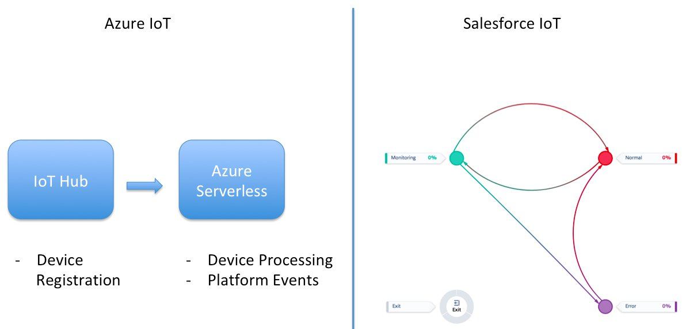

## Disclaimer

As Safe Harbour/disclaimer, Azure IoT is not free (be careful which options you select) and therefore the architecture for this demo is not anywhere near Production class.  I have implemented the skinniest implementation possible, which we will scale out in Part 2, but the objective is to get started  (for free) and then develop additional services as needed.  For real life scenarios, you would need additional services such as the ones listed as a minimum.  Real life architecture will require some or all of these additional core Azure PaaS services such as;


* CosmoDB
* Streaming Analytics Jobs
* Service Bus
* Event Hub
* PowerBI / Time Series
* Node Web Apps Service
* ...

For those interested please see the Microsoft Azure IoT Reference Architecture Guide http://bit.ly/2DJlCgW


# Create your Platform Event in Salesforce

The first step on our journey is to create our Platform Events, which is the primary method for integration between Microsoft and Salesforce.  For the purposes of our demo app, I have created a Platform Event in my Org to simulate a very basic **Drinks Machine.** The key elements I am capturing are ;


* Serial Number
* Error Codes
* Temperature
* Humidity

Please replicate the above in your org or re-use any Platform Events you already have.  If you have completed your Trailhead IoT Trails then you could re-use your Fridge example.

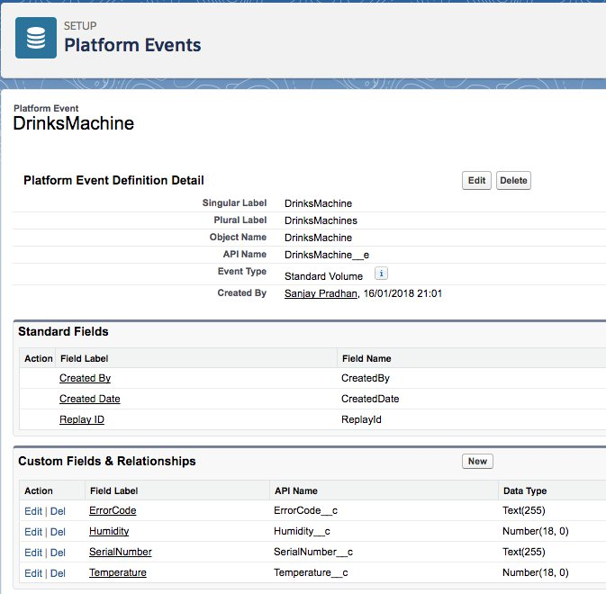

Using Workbench (http://bit.ly/2DRgAOv) and the REST Explorer endpoint **/services/data/v41.0/sobjects/DrinksMachine__e** I am able post data into my Platform Event.  Once  successful,  we have the JSON payload required by Salesforce and the definition of what Azure needs to send via our Serverless Function App integration (more about this later!).

`{`
`   "SerialNumber__c" : "SKP12345",`
`   "ErrorCode__c" : "EC-6789568",`
`   "Temperature__c" : 78,`
`   "Humidity__c" : 55`
`}`


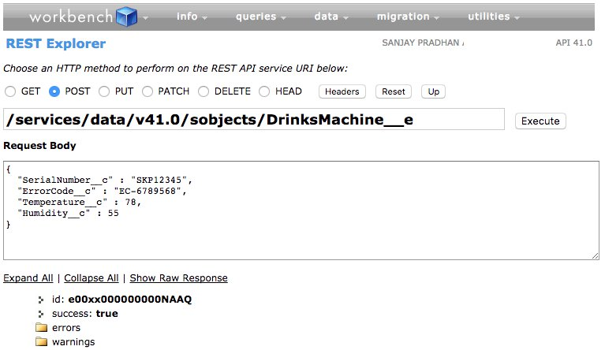

# Create a Connected App in your Salesforce Org

Create a new Connected App in your Salesforce Org and make a note of the **CONSUMER KEY** and **SECRET.** Follow the following Trailhead which steps you through the process (http://sforce.co/2Eh8fSg).

**Connected Apps** are external applications/api's that can **connect** to S**alesforce Platform** over Identity and Data APIs. **Connected Apps** use the standard OAuth 2.0 protocol to authenticate, provide Single Sign-On, and acquire access tokens for use with Salesforce APIs.  This is the standard mechanism for connecting api based applications in the Salesforce Platform and necessary when we configure the Azure Serverless Function in Node.js (more on this later).

Here is an example what this looks like in my Org.

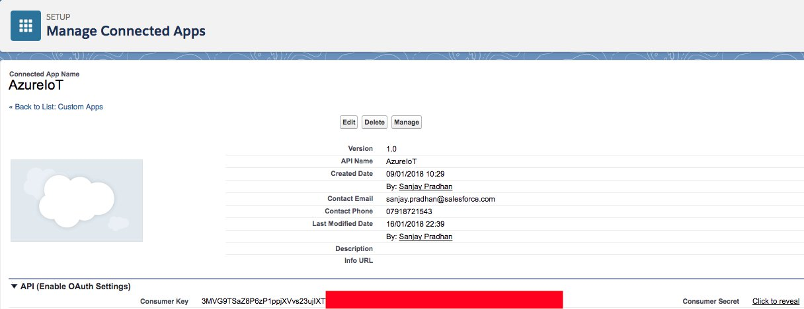

# Create your IoT Explorer Orchestration

Create a basic IoT Explorer Orchestration so you can test your Integration.  Follow the Trailhead (http://sforce.co/2rQI3eH)  if you haven't built an Orchestration before or need a refresher.  Here is my example Orchestration for reference and ensure that you test this with Workbench to make sure your Platform Events trigger the Orchestration.

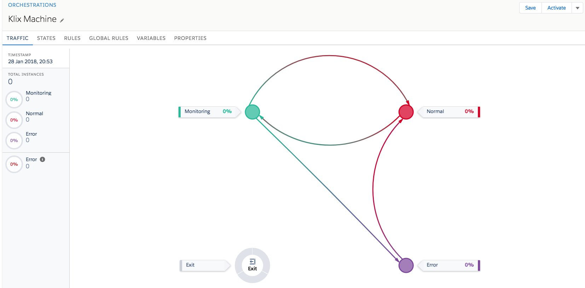

# Create your Microsoft Azure Portal Account

Now onto the fun stuff.  You will need to sign up to the Microsoft Azure Portal at [https://portal.azure.com](https://portal.azure.com/) .  If this is your first time then you will receive some complementary credits, but as part of the sign up you will need to provide your credit card details.  Please check with your management regarding reimbursement.   I selected the “**pay-as-you-go-plan**” for my local Azure Service in my region.


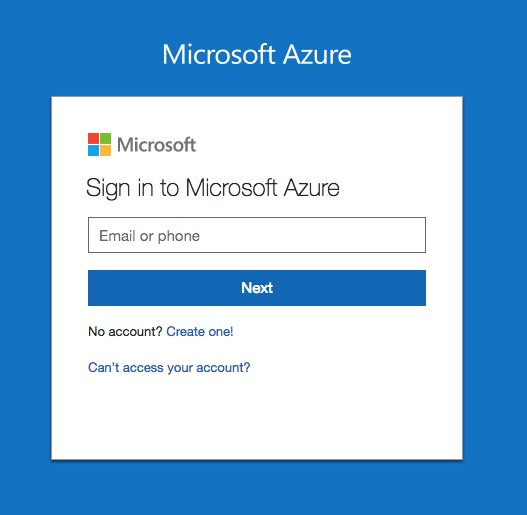


# Create your IoT Azure Services

Within the Azure Portal Interface we will configure 3 components;


1. Create an** IoT Hub** (this is the main interface for all devices)
2. Create our example **Device** (which we will use in Part 2 of this guide)
3. Create our **Azure Serverless Function App** (where we will create our Platform Events)

## Create your IoT Hub

The first step is to create the IoT Hub.  This is the Device hub via which all registered devices will communicate with the  underlying Azure infrastructure.  It is where you can register, secure, authorise and serve all devices.  Click on **New** → **Internet of Things** → **IoT Hub**

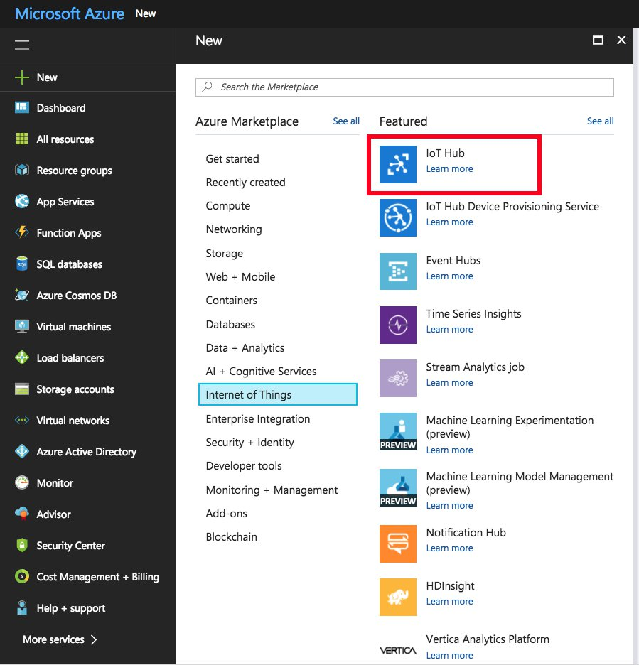

You will be presented with the configurator.   Give your IoT hub a sensible name such as **Salesforce-IoTHub (**all hub names need to be unique across Azure).  Then select the pricing.  Make sure you select the **Free tier**- the default is set to a chargeable “**S1 - Standard**” pricing tier so make sure you select the free option (if available).

Ensure that you minimise your configurations to avoid additional charges.  Select **2** in the device-to-cloud section and make sure you select your subscription that you selected on sign-up.

You will need to assign the IoT Hub to a Resource Group.  A Resource Group is nothing more than a collections of services that you can apply joint security access, permissions and policies against for management and administration purposes.  Create a new group such as **Salesforce_Resource_Group** where we can add all of our components into a common policy container such as our IoT Hub and Serverless Function App.

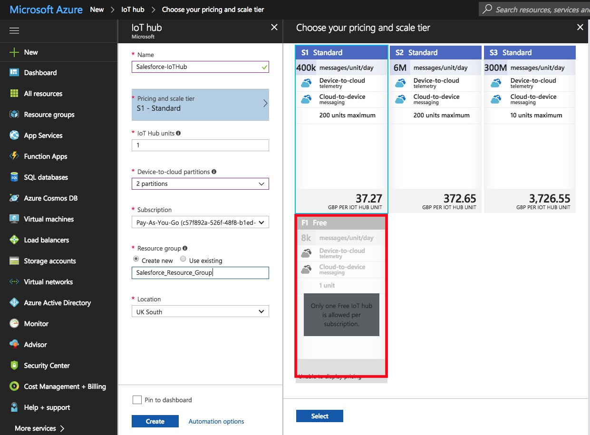

Additionally, select the **Pin to dashboard** option so you have a bookmark into your IoT Hub on the **Dashboard** page of the Portal.  Click **Create** and wait - be patient as it can take a few minutes for the services to spin up.  After a few minutes you will see your IoT Hub and all it's config details.

Now we are ready to add a Device registration to our IoT Hub. Click on **IoT Devices** section.

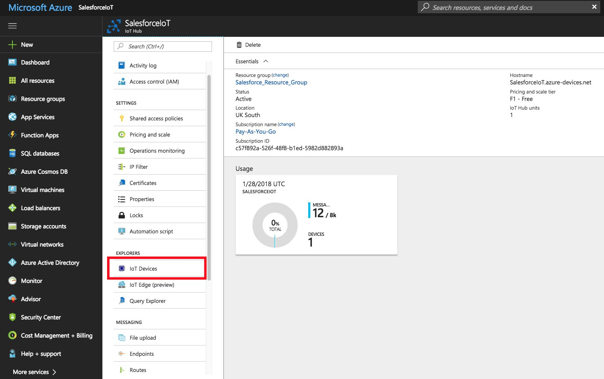

## Register a Device to your IoT Hub

Once we have our IoT Hub defined we are ready to register our first Device.  Please note, in this guide we do nothing with the device we register. For now it is a placeholder for a future guide where we simulate real time streaming data.  However, this is good practice to familiarise yourself with the process.

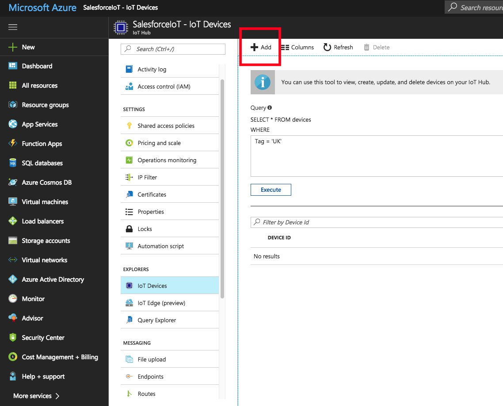

Click **Add** and start to configure your device details.  For the purposes of my Drinks Machine I am configuring the following


* Device Id : MarsKlix-001
* Authentication Type: Symmetric Key
* Auto Generate Key : Yes
* Connect Device to IoT Hub : Yes

Click **Save** and wait until the Device is registered and you can see it listed in the IoT Hub.

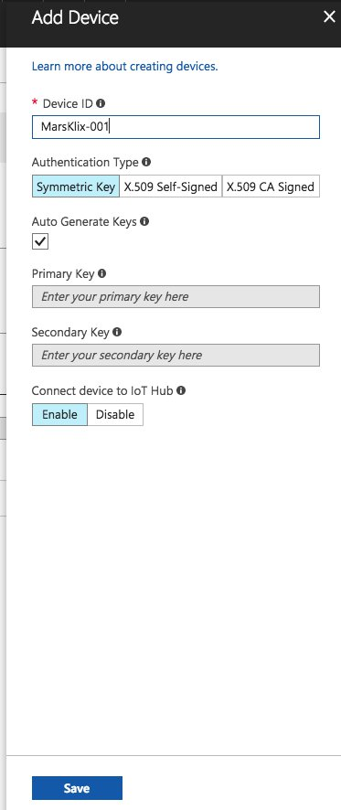

Once created you have all the security and metadata required to control and receive events from the device as we will see in Part 2 of this guide.  Once you have finished you should have a screen which has your demo device registered within the IoT Hub.  Its important to keep the credential details secure as this controls the device authentication and communication in real time (and the charges you can incur when streaming - hence I have obfuscated those details).

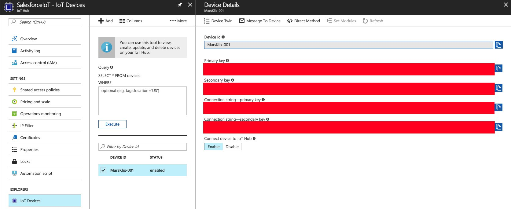

Now we are ready to create our Serverless Function App and start coding our Platform Events and Integrate with Salesforce IoT Explorer.


## Create a New Serverless Function App

The Function App is the processor for our device events and responsible for generating Platform Events.  When you create a Function App, it runs in a container/server that Azure provisions on demand at runtime (which we don't need to create, hence the Serverless name).  However, it is still a container which we need to configure what Node packages we want to include as part of our function operation.  Therefore there are a few config steps.   Click on **New** → **Function App**

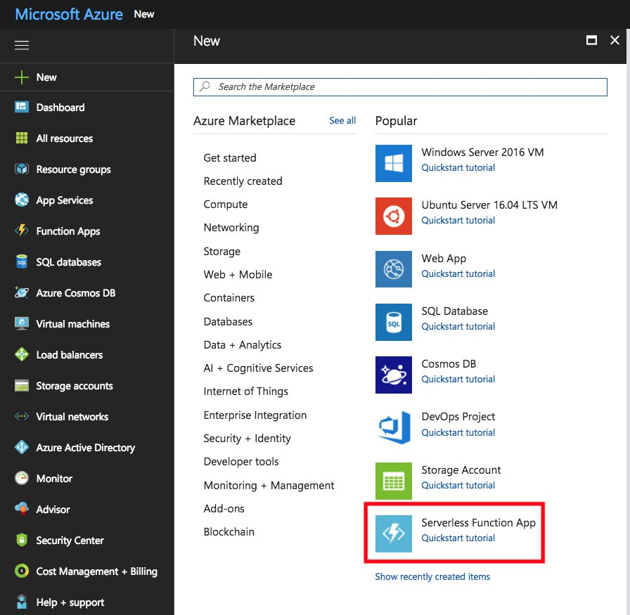


Now configure the core settings.  **App name** needs to be unique across Azure because it creates a domain registration for the endpoint.  Ensure you select your default subscription and make sure your **Hosting Plan** is set to **Consumption Plan** (this enables charging on demand as opposed to fixed billing).  Pick your location and storage options.  Function Apps require storage for files and data.  I am creating a new storage for my Function App.  Make sure you pin the Function App to your dashboard so that it is easily accessible when it completes.

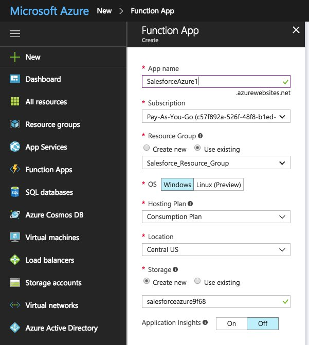

When you are ready click **Create** and wait.  When this operation completes navigate to your newly created SalesforceAzure1 (or equivalent) FunctionApp.

## Configure Function App

Click on the newly created Function App and see it's status.  If it is running, click on the **Platform features link** in the top menu and launch the features panel, which enables  access to key server services such as networking, DNS, SSL and other services.

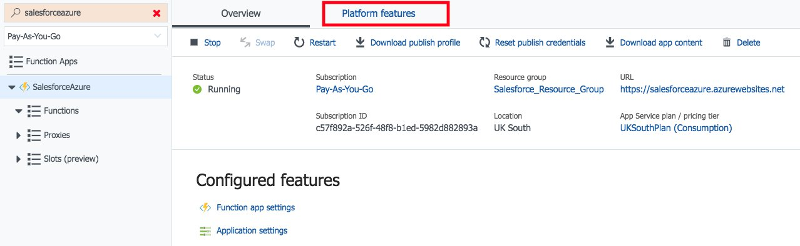

The only service we need to configure are in the Advanced tools (known as Kudu) which will launch the browser based command line.

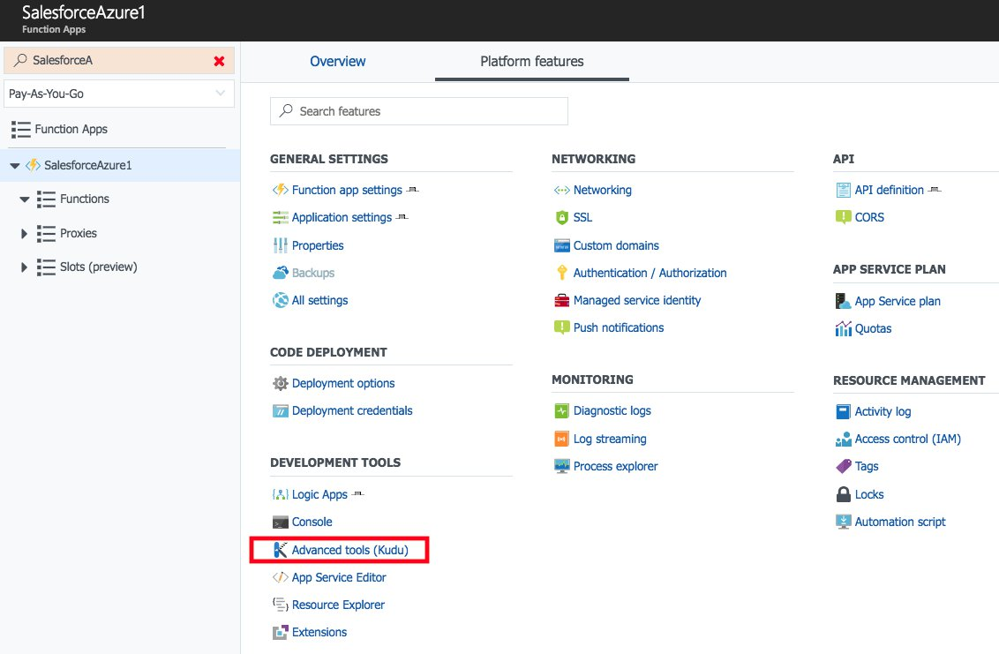

The command line can be found in the **Debug console,** select the CMD shell.

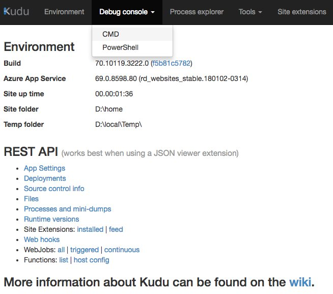

This will launch the combined file system and command line view where we can configure the Function App configuration.  We can now Install everything we need and prepare our Node.js environment.

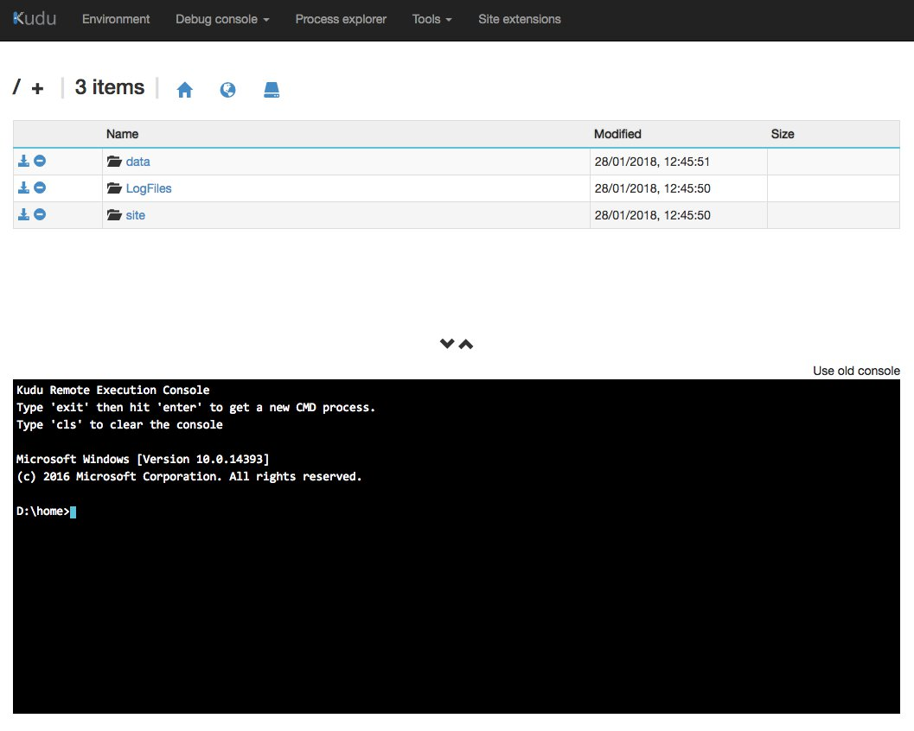

## Create Package.json file and install Node.js Modules

Within the Kudu console create a package.json file.  This is just package configuration file that describes the Node application that we will create to send Platform Events.  Within the console window type the following.

`D:\home>``touch packa`g`e.json`

This will create an empty file that will be used by the Node Package Manager when we configure the Node application in the next few steps.  You should now see the package.json file listed in the file system.

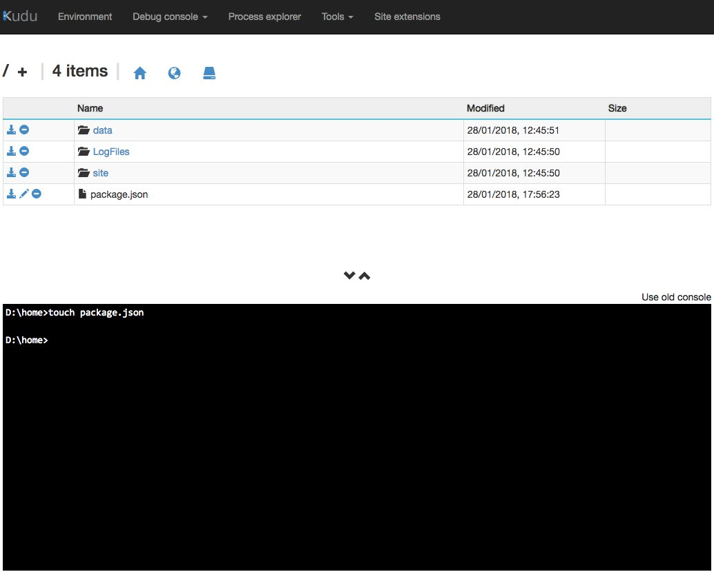

Click on the edit icon on the **package.json** file and add the following snippet to the file and Save

```
{
  "name": "azure-force",
  "version": "0.0.1",
  "description" : "Saleforce-Platform-Events-Connector",
  "dependencies": {
    "express": "*",
    "nforce": "*"
  }
}
```

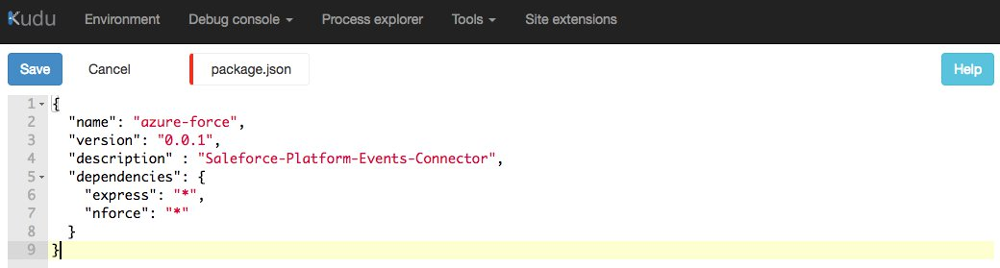

Now return to the command line and enter the following line.

`D:\home>npm install --save`

This will install all the packages that were defined in the package.json file that we created previously.  The main package is called **nforce.** Nforce is a Node package that enables javascript access to Salesforce, including authentication using a connected app that was created earlier.  More information on nforce can be found here http://bit.ly/2DIEIUb . This command will locally install all the required modules for the Function App as can be seen in the screenshot below.

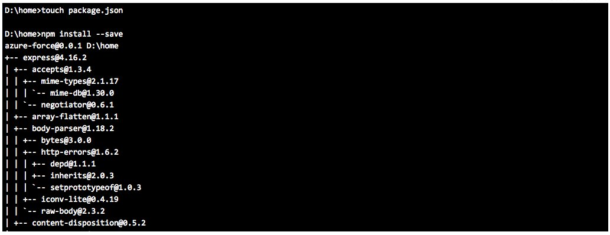

## Create a New function within your Serverless Environment

We have now configured our virtual server for Node.js. We can now create our function and link it to our **IoT Hub **messages that will be received from the device**.  **Go back to the **SalesforceAzure1** Function App and create a new function.** **

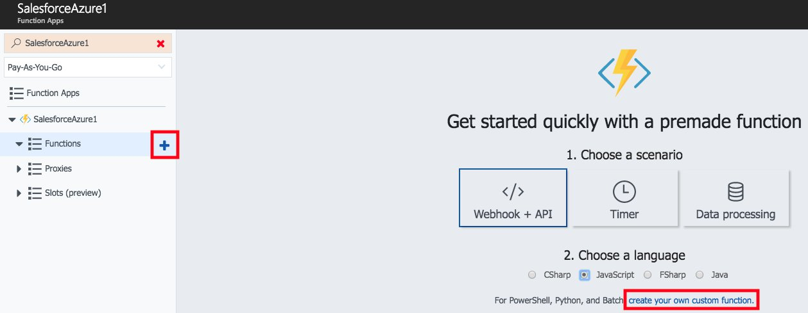

This user Interface is slightly confusing.  Do not pick the defaults and instead pick the **create your own custom functions.  **This will launch a list of quickstart templates.  Pick the **Event Hub Trigger** - Javascript template.

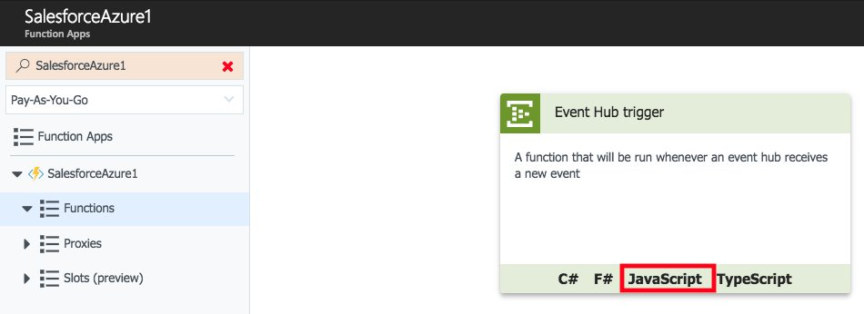

A Function App is triggered when an Event Hub is triggered.  The next screen is where we tie together our IoT Hub Events to the Handling FunctionApp code.

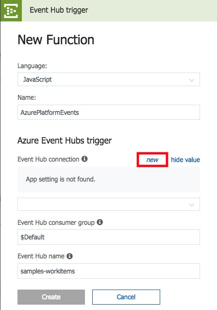

By default your IoT Hub that you created earlier should display in the dropdown list.  Select the **IoTHub** you created earlier and use the built-in endpoints which should be the default settings.

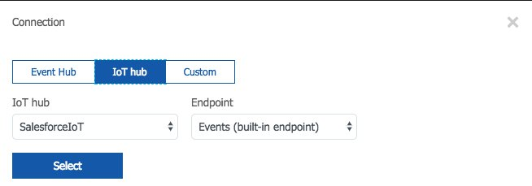

You should see the default javascript function stub code which we will modify.

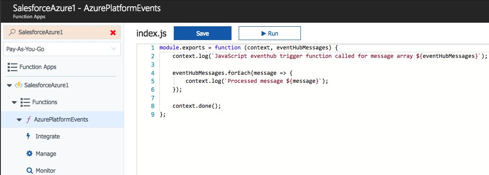

## **Create Azure Platform Event from the Serverless Function**

We have now bootstrapped our FunctionApp and bound it to our Azure IoT Hub.  Now we need to create Platform Events from the payload we will receive from the device and test using the inbuilt FunctionApp tester.  Copy the code below in the code window above and click **Save.** Make sure to fill in details such as Org Details, User Id, Passwords and Connected App details.

All this code does is authenticate against your Org using your OAuth details and the Connected App setting you provide and create a Platform Event using the nforce and the eventHubMessages that we have encoded into JSON.

```
module.exports = function (context, eventHubMessages) {
    context.log(`JavaScript eventhub trigger function called for message array ${eventHubMessages}`);

     var nforce = require('nforce');
     var request=require('request');
    // saleforce log in details
    var SF_CLIENT_ID ='<INSERT_CONNECTED_APP_CLIENT_ID>';
    var SF_CLIENT_SECRET = '<INSERT CONNECTED APP SECRET>';
    var SF_USERNAME = 'sanjay.pradhan@drinks_machine.iot';
    var SF_ENVIRONMENT = 'Production';
    var SF_PASSWORD_FULL = '<SALESFORCE USERID PASSWORD>';
    var SF_CALLBACK_URL = 'http://localhost:3000/oauth/_callback';
    var org = nforce.createConnection({
        clientId: SF_CLIENT_ID,
        clientSecret: SF_CLIENT_SECRET,
        redirectUri: SF_CALLBACK_URL,
        environment: SF_ENVIRONMENT,
        mode: 'single'
    });
    org.authenticate({ username: SF_USERNAME, password: SF_PASSWORD_FULL},
    function(err, resp){
        if(!err){
           context.log('Successfully connected to Salesforce, Cached token: ' + org.oauth.access_token);
           context.log(eventHubMessages[0]);
           var jsonMsg=JSON.stringify(eventHubMessages[0]);
           var jsonObj= JSON.parse(jsonMsg);
           //CREATE DrinksMachine Platform Event
           var evt = nforce.createSObject('DrinksMachine__e');
           evt.set('SerialNumber__c',jsonObj.SerialNumber__c);
           evt.set('ErrorCode__c',jsonObj.ErrorCode__c);
           evt.set('Temperature__c',jsonObj.Temperature__c);
           evt.set('Humidity__c',jsonObj.Humidity__c);

           org.insert({ sobject: evt }, function(err, resp){
           if (!err) {
                    context.log('SUCCESS :: Platform Event Sent');
           }
           else {
                    context.log(err);              }
           });

        }

        if(err) context.log('Cannot connect to Salesforce: ' + err);
    });
    context.log(`Processed message ${eventHubMessages}`);
    context.done();
};
```

## Test your FunctionApp and Build connect it to Salesforce IoT Explorer

In the right hand side bar of the Portal click on the **Test** link to open the Azure FunctionApp Tester.  Enter an example payload in JSON format and hit **Run.** The payload could be the  same as you tested your Platform Events in Workbench.  Copy and paste the payload and watch the log window.  It may take a few seconds to compile and run the function.

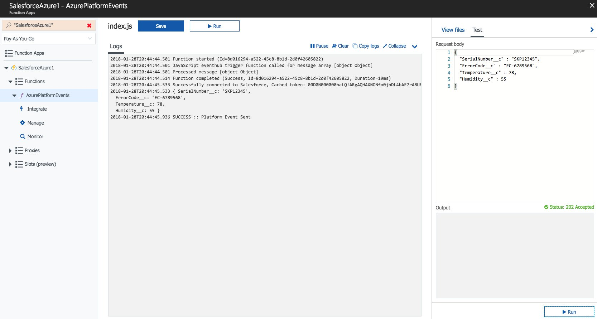

If see the following entries in your Log files then **congratulations**!  you have successfully integrated Azure IoT to Salesforce IoT Explorer via Platform Events.
Your Orchestration that you created in IoT Explorer should now be active and receiving events from Azure IoT.

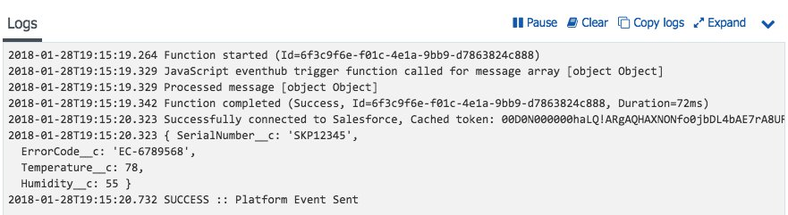

# Recap and Summary

In Part 1 of this guide we have built out the rudimentary infrastructure to setup Microsoft Azure IoT Services and integrated Salesforce via Platform Events.  This is the most basic of demo scenarios and we haven't built out any advanced features such as device telematic dashboards, streaming analytics, edge processing or even connecting simulated drinks machines to our newly created setup. Stay tuned for Part 2 of this guide where we will explore all of these concepts.

#
