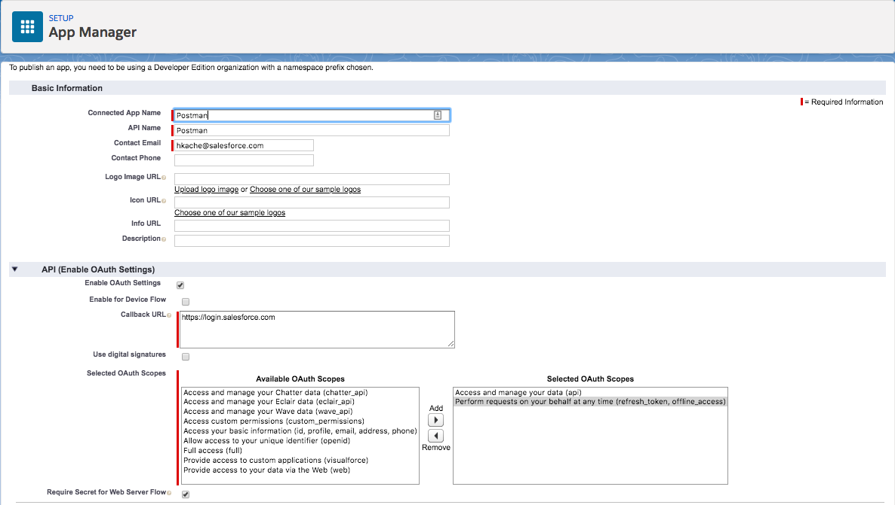
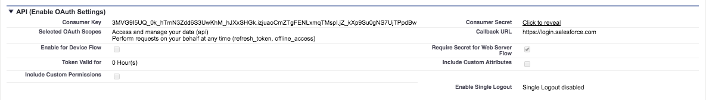
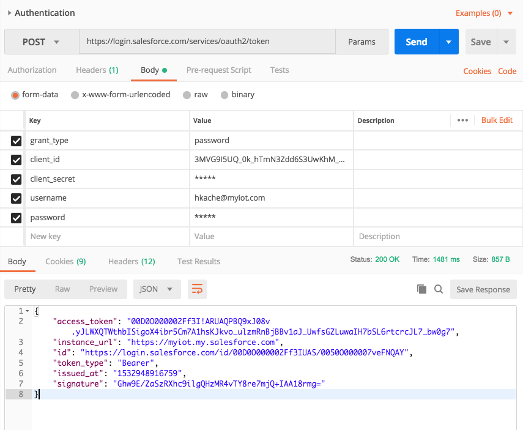
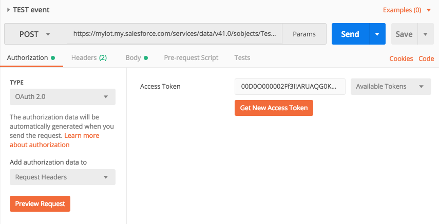
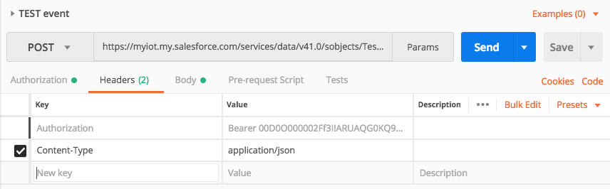
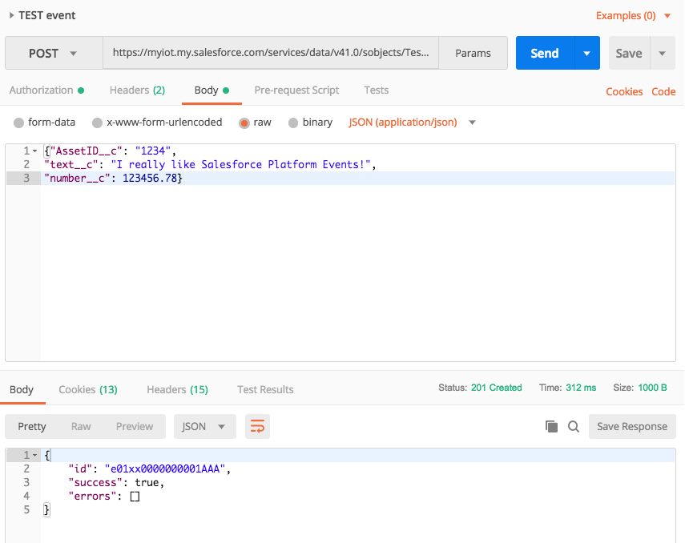

# Ingest Salesforce Platform Events using Postman

Salesforce IoT Explorer works with the Salesforce Event Management Platform (EMP) as message bus. Messages are ingested as Platform Events using REST APIs and JSONS encoding. 

For a full documentation of the Platform Events REST API see [https://developer.salesforce.com/docs/atlas.en-us.platform_events.meta/platform_events/platform_events_publish_api.htm
](https://developer.salesforce.com/docs/atlas.en-us.platform_events.meta/platform_events/platform_events_publish_api.htm)

Platform Events are REST resources that are scoped at the organization level. A typical resource URL will look like

`https://<instance>.salesforce.com/services/data/<version>/sobjects/<EventName>__e`

(e.g. `https://myiot.my.salesforce.com/services/data/v41.0/sobjects/Test__e`)

To work with the Platform Event resources you have to authenticate the client application with the Salesforce organization first. Salesforce provides a number of authentication flows. Developer documentation can be found at[https://developer.salesforce.com/docs/atlas.en-us.api_rest.meta/api_rest/intro_understanding_authentication.htm](https://developer.salesforce.com/docs/atlas.en-us.api_rest.meta/api_rest/intro_understanding_authentication.htm)

For the purpose of this document I will use the simple Username-Password OAuth authentication flow documented 
[here.](https://developer.salesforce.com/docs/atlas.en-us.api_rest.meta/api_rest/intro_understanding_username_password_oauth_flow.htm)

Postman will be used to authenticate with the Salesforce platform and perform the ingestion of a single Platform Event only. APIs for bulk ingestion are out of scope for this documentation but are available using [the composite object collections API.](https://developer.salesforce.com/docs/atlas.en-us.api_rest.meta/api_rest/resources_composite_sobjects_collections_create.htm)

## 0. Prerequisite

To follow the end-to-end setup described in this document you have to meet these prerequisites:

* Have a user to a Salesforce org
* Have a Platform Event created for ingestion. (If you need to set one up, follow the details in this trail: [https://trailhead.salesforce.com/en/modules/platform_events_basics](https://trailhead.salesforce.com/en/modules/platform_events_basics))
* Have Postman installed. (Get it from [https://www.getpostman.com/](https://www.getpostman.com/))


## 1. Create Connected Application

In a first step you have to register Postman (the client app) as connected app in the Salesforce org to allow for OAuth 2.0 authentication between the client and the server. This is a one time setup for the given client and Salesforce org. Session authentication will later be based on an access token exchange.

**Connected App configuration**

To create the Connected App, open your Salesforce org and find Setup → Apps → App Manager. Click `New Connected App` at the top of the page.

Provide the following `Basic Information`:

* Connected App Name (no spaces of special chars)
* API Name (will be auto-populated)
* Contact Email (your email)

In the `API (Enable OAuth Settings` section:

* Check `Enable OAuth Settings`
* For `Callback URL` use [https://login.salesforce.com](https://login.salesforce.com/)
* For `Selected OAuth Scopes` use
    - `Perform requests on your behalf at any time (refresh_token, offline_access)`
    - `Access and manager your data (api)`

Keep the default settings for everything else and hit `Save`. Confirm the next page with `Continue` and wait 2-10 minutes for the app to be created.



The next page will present you with the `Consumer Key` and `Consumer Secret` for the conneceted app. Please make note of these two values.



## 2. Issue request to retrieve access token with Postman

Open Postman and create a new POST request. The details for the request are as follows:

* URL: `https://login.salesforce.com/services/oauth2/token`
* Authorization: `No Auth`
* Headers: `Content-Type: application/x-www-form-urlencoded`
* Body:
  - `grant_type: passsword`
  - `client_id: <Consumer Key from Salesforce connected app>`
  - `client_secret: <Consumer Secret from Salesforce connected app>`
  - `username: <Username for target Salesforce org>`
  - `password: <Password for Salesforce user>`

Submit the request. The response body will contain the `access_token` needed for authentication with the actual resource endpoint.



**Request the authorization code using cURL**

For reference, here is the curl statement to submit if you prefer curl over Postman:

```
curl -X POST \
  https://login.salesforce.com/services/oauth2/token \
  -H 'Content-Type: application/x-www-form-urlencoded' \
  -F grant_type=password \
  -F 'client_id=<Consumer Key from Salesforce connected app>' \
  -F 'client_secret<Consumer Secret from Salesforce connected app>' \
  -F 'username=<Username for target Salesforce org>' \
  -F 'password<Password for Salesforce user>'  
```

Make note of the access token in the response.

**Troubleshooting**

If you are getting a response like

```
{
    "error": "unsupported_grant_type",
    "error_description": "grant type not supported"
}
```

you most likely used the wrong combination between your `Content-Type` and provided body. Make sure to supply your data as `x-wwww-form-urlencoded` and not as payload in `application/json` or any other encoding. 

The provided key/value pairs are expected to be URL encoded parameters to the request. Postman will automatically encode values to be RFC 3986 compliant. If you are using another client like curl you may have to manually encode values that have special characters (as passwords often do). Consult https://www.urlencoder.org/ or other online services for details.

## 3. Issue request to ingest Platform Event with Postman

Finally you can ingest a Platform Event using the computed access token for authentication. Assuming an org called `myiot` with a platform event called `Test__e`, construct a POST request as follows (make sure to postfix the event name with `__e`):

* URL: `https://myiot.my.salesforce.com/services/data/v41.0/sobjects/Test__e`
* Authorization: `OAuth 2.0` (copy the Access Token retrieved above)



* Headers: `Content-Type: application/json`



* Body: (provide the JSON respresentation of your Platform Event including the required fields at a minimum)
e.g. 
```
{"AssetID__c": "1234",
"text__c": "I really like Salesforce Platform Events!",
"number__c": 123456.78}
```



Inspect the body of your response. The successful execution will contain the `id` of the ingested PE:

```
{
    "id": "e01xx0000000001AAA",
    "success": true,
    "errors": []
}
```

**Issue the request using cURL**

For reference, here is again the curl statement to submit if you prefer curl over Postman:

```
curl -X POST \
  https://myiot.my.salesforce.com/services/data/v41.0/sobjects/Test__e \
  -H 'Authorization: Bearer <access token>' \
  -H 'Cache-Control: no-cache' \
  -H 'Content-Type: application/json' \
  -H 'Postman-Token: 456fcc14-bef4-4a2f-a0b9-34662a856988' \
  -d '{"AssetID__c": "1234",
"text__c": "I really like Salesforce Platform Events!",
"number__c": 123456.78}'
```

**Troubleshooting**

If you are getting a response like

```
[
    {
        "message": "Session expired or invalid",
        "errorCode": "INVALID_SESSION_ID"
    }
]
```

you simply have to update your access token. The one you supplied may has expired at this point.

If you are getting a response like

```
    {
        "message": "You must enter a value",
        "errorCode": "REQUIRED_FIELD_MISSING",
        "fields": [
            "AssetID__c"
        ]
    }
]
```

you failed to provide all the required fields identified in the Platform Event definition. Make sure to prefix all custom field names with `__c`. 
